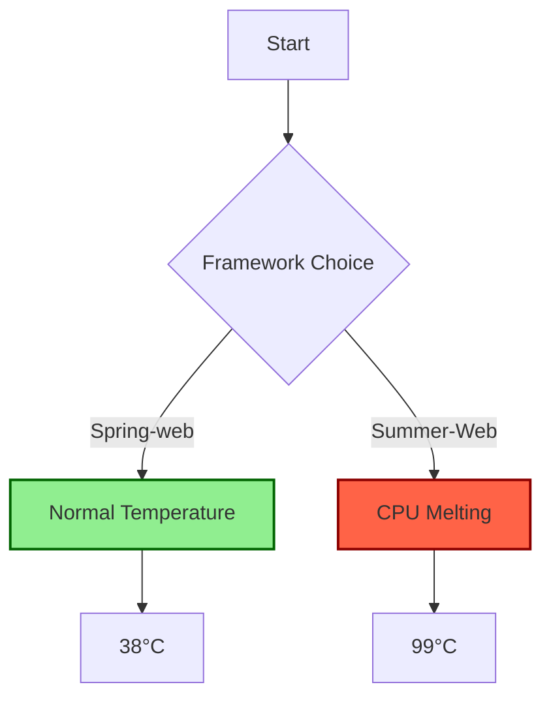

# Summer-Web: Bringing Summer to Your CPU! ☀️🔥

While Spring brings a cool breeze, Summer-Web brings a heatwave to your server!
Enjoy slow speeds and high CPU usage that turn your server room into a sauna.

## Adding the Dependency

### Gradle
```groovy
dependencies {
    implementation 'io.github.hellomatia:summer-web:1.0.0'
}
```

### Maven
```xml
<dependency>
    <groupId>io.github.hellomatia</groupId>
    <artifactId>summer-web</artifactId>
    <version>1.0.0</version>
</dependency>
```

## How to Use

1. Server Setup:
```java
import server.core.Server;

public class Main {
    public static void main(String[] args) throws IOException {
        Server server = new Server(8080, 10, "your.basePackage.");
        server.start();
    }
}
```

2. Create a Request Handler:
```java
import server.handler.CustomRequestHandler;
import server.handler.annotation.Handler;
import server.handler.annotation.HttpMethod;
import server.http.HttpRequest;
import server.http.HttpResponse;

@Handler("/")
public class SummerHandler extends CustomRequestHandler {
    @HttpMethod("GET")
    public HttpResponse moveMainPage(HttpRequest request) {
        return ok("Hello Summer!".getBytes())
                .build();
    }
}
```

## Features

- Guaranteed higher CPU temperatures than Spring-web!
- Astounding low performance to justify your infrastructure investments!
- Code execution so slow, you'll have time for a coffee break!

## CPU Temperature Comparison Graph
### Spring-web VS Summer-web


